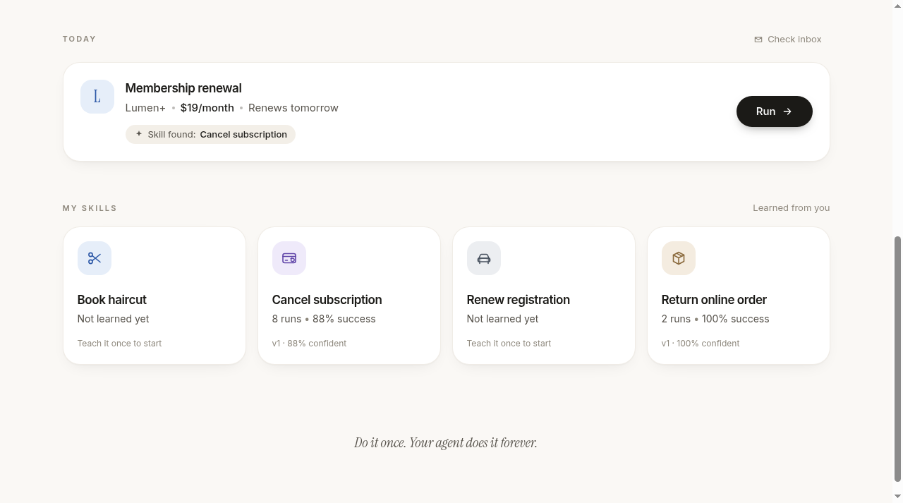
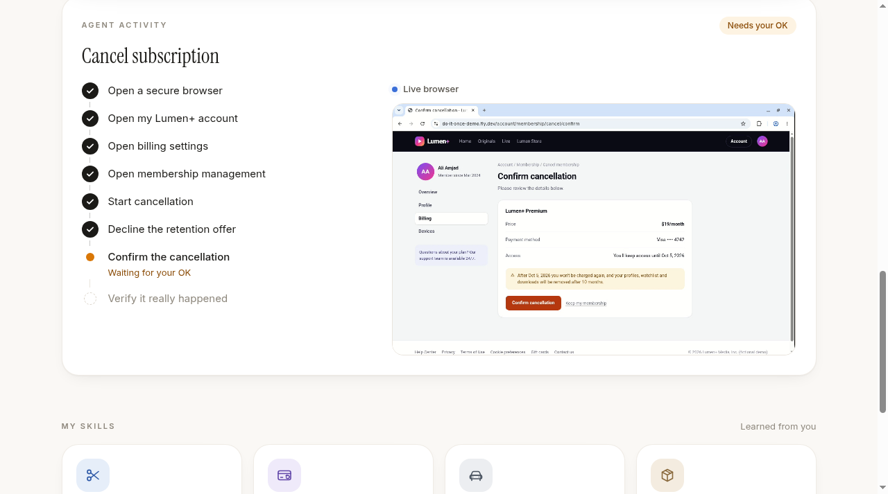
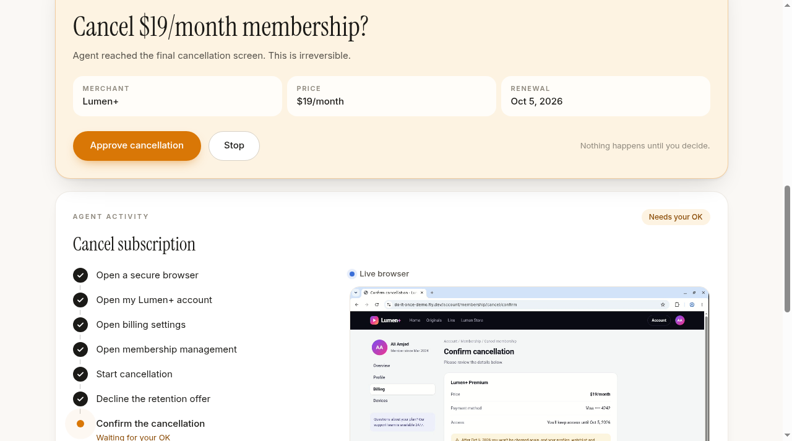
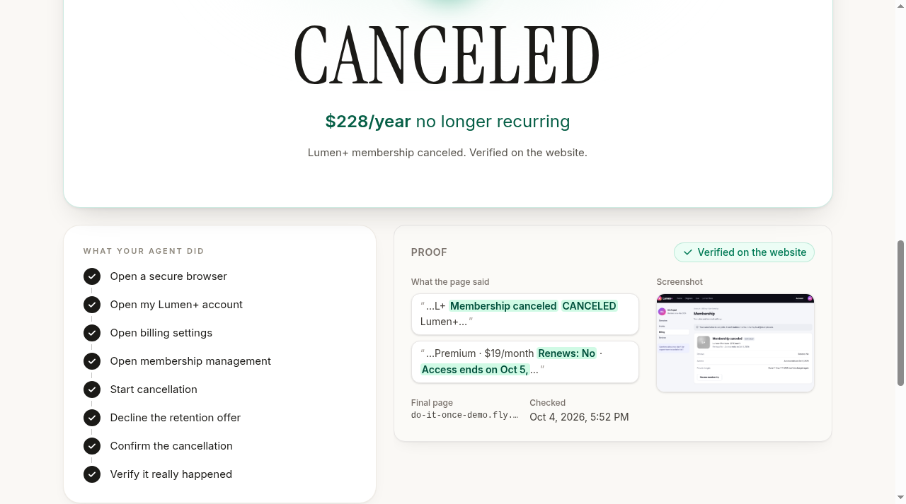
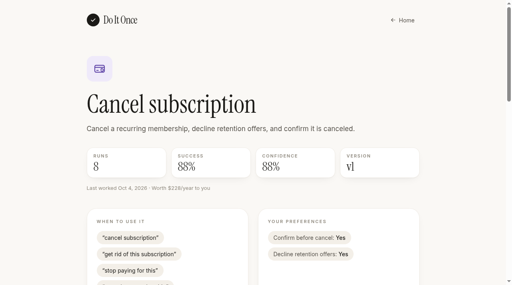
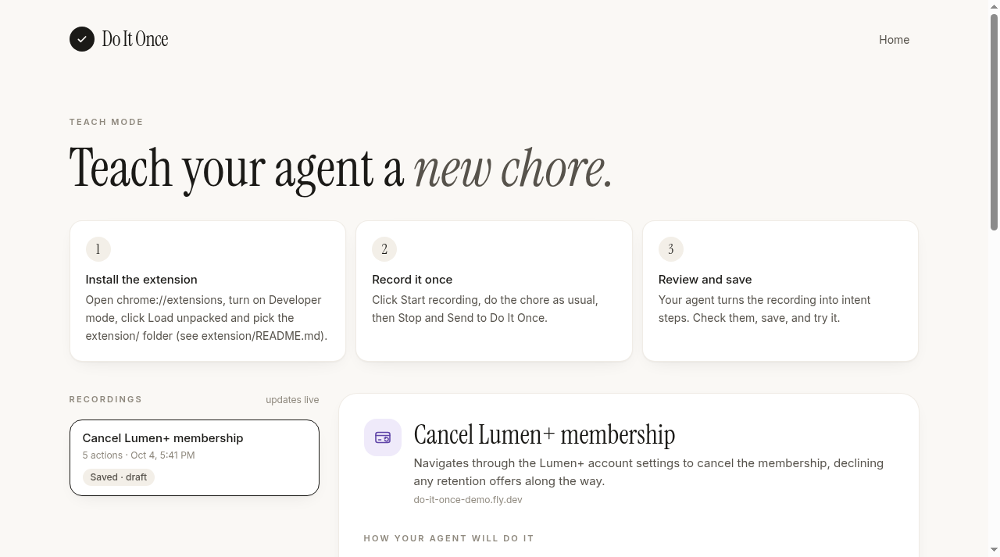
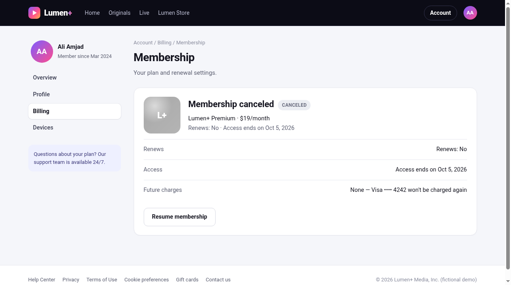
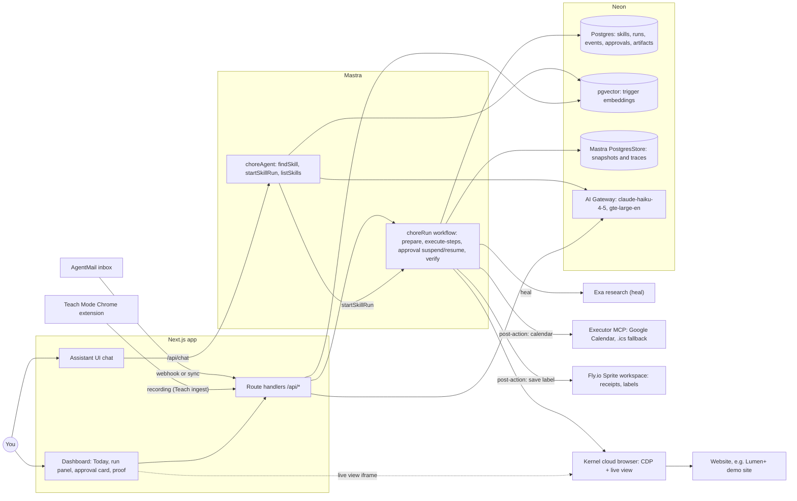

# Do It Once

**Do it once. Your agent does it forever.**

Do It Once is a personal agent for the boring web chores of your own life. You show it a chore
once. It keeps that chore as a skill. When the chore comes back (a renewal email lands, or you say
"get rid of this subscription"), the agent opens a real cloud browser, replays what worked last
time, and stops to ask you before anything you can't undo. It counts the chore as done only after
it checks the website and saves proof.

**Try it:** app at **https://neon-agent-ali.fly.dev**, fictional demo website at
**https://do-it-once-demo.fly.dev**. Agent inbox: `do-it-once-agent@agentmail.to`.

> Status: hackathon build, deployed on Fly.io. Everything below is in the code on this branch and
> running live. See [Honest status](#honest-status--limitations) for the limits.

---

## Problem

**People repeatedly relearn the same boring workflows required to operate their own lives.**

Cancel a subscription. Return an item. Renew a registration. Book the same appointment. Each of
these comes back every month or every year, and each time we start from zero: which menu was it
under, which "no thanks" link skips the retention offer, which button is the real one. Generic
browser agents also start from zero on every run, and they will happily click an irreversible
button on their own.

## Solution

Do It Once turns a chore you did once into a **personal skill**: a short list of intent-based
steps ("Open billing settings", "Decline the retention offer") with the evidence expected after
each one and the last selector that worked. It does not store a brittle macro. Then:

- **Triggers find the chore for you.** An email to the agent's own inbox (AgentMail) is classified
  and matched to a skill, and it shows up as a card under **Today**. You can also just type what you
  want in the chat.
- **Replay happens in a real browser you can watch.** A Kernel cloud browser runs the steps while
  its live view is embedded in the run panel.
- **A human approves every irreversible step.** The run is a Mastra workflow that *suspends* before
  an irreversible step and keeps that snapshot in Neon Postgres. It can wait for you across a server
  restart.
- **The agent proves the result.** Every run ends with verification rules checked against the real
  page (text and URL), plus a screenshot saved as evidence. The run never relies on an LLM saying "done".
- **Skills heal when websites change**. When a stored step no longer
  matches the page, the agent researches the current procedure with Exa, explores the live page,
  finishes the chore and saves a new version of the skill.

---

## Demo

The 60-second judging story. The full script with clicks, timings and the reset checklist is in
[docs/DEMO_SCRIPT.md](docs/DEMO_SCRIPT.md).

1. **A renewal email arrives.** `npx tsx scripts/agentmail-send-demo.ts` sends "Your Lumen+ Premium
   membership renews tomorrow" from `lumen-billing-demo@agentmail.to` to the agent's AgentMail inbox.
   The webhook hits the Fly app, and in about 5 s a Today card appears with the merchant, price and due date, and the line
   **Matching skill: Cancel subscription**.

   

2. **Run** (or type *"Get rid of this subscription"* in the chat; the first reply takes about
   10–18 s). The run panel opens with the agent's activity checklist next to the Kernel live view.

   

3. **The agent stops before the irreversible click** (about 18–31 s after Run). "Cancel $19/month
   membership?" The price, renewal date and merchant are read from the page itself.

   

4. **Approve.** In about 10 s the agent clicks the final button, checks the website and shows **CANCELED,
   $228/year no longer recurring**, with the proof panel (matched evidence, final URL, screenshot,
   timestamp).

   

5. **The website changes, and the skill heals.** `POST /api/demo/layout {"layout":"v2"}` switches
   the demo site to layout v2: Billing moves under "Plan & payments" and every button is renamed.
   The stored step fails, the agent runs a real Exa search (on this fictional site it finds nothing
   published, so it says so and reads the live page instead), explores the page, and reaches the
   approval card at about 55 s. Approve, and about 12 s later the run is verified. The skill is now
   version 2, and the next run on v2 goes straight through with no heal (approval at about 22 s).

   

6. **Return an item, with post-actions.** The "Return online order" skill fills the Lumen Store
   return form from its saved preferences and stops for approval (about 30 s). After Approve
   (about 9 s), the return label is saved to the Fly Sprite (about 3.5 s later) and Executor
   creates a real Google Calendar drop-off event (about 19 s later).

7. **Teach a new chore.** The Teach Mode extension sends a recording to `/api/teach/recordings`;
   `/teach` shows it normalized into an intent-based skill, and **Try it now** replays it (approval about 19 s, success
   about 8 s after Approve).

   

The demo website itself is fictional by design:



---

## How it works

Observe → Learn → Store → Trigger → Replay → Verify → Heal

| Stage | What happens | Where in the code |
|---|---|---|
| **Observe** | Teach Mode: a Chrome MV3 extension records clicks, final typed values, selects and navigations with role, accessible name, label and a best-effort Playwright selector. Passwords, card numbers, OTPs and similar fields are redacted in the browser before anything leaves it. | `extension/recorder.js`, `extension/lib.js`, `extension/background.js`, `extension/README.md`; `Recording` type in `lib/contracts.ts` |
| **Learn** | A recording becomes an intent-based skill (`SkillStep`: intent, action, target description, expected-after text, locator hint, approval flag). `POST /api/teach/recordings` stores the recording and a normalizer (claude-sonnet-4-6 through the Neon AI Gateway) turns it into steps, a verification rule and trigger phrases. | `app/api/teach/`, `lib/learn/`, `app/(dashboard)/teach/`, `db/migrations/005_teach_recordings.sql`; seeded skills in `lib/neon/seed-data.ts` |
| **Store** | Skills, steps, triggers, preferences, runs, events, approvals and artifacts live in Neon Postgres. Trigger phrases are embedded with `gte-large-en` (1024 dims) through the Neon AI Gateway and stored in `vector(1024)` columns with HNSW cosine indexes. | `db/migrations/001_init.sql`, `002_skill_embeddings.sql`, `lib/neon/repo.ts`, `lib/skills/retrieve.ts`, `scripts/embed-skills.ts` |
| **Trigger** | AgentMail webhook (Svix-verified) or a pull sync ingests mail. A regex pre-pass plus a Neon AI Gateway classifier extract merchant, amount, cadence and due date. pgvector retrieval matches a skill, and an idempotent `incoming_triggers` row becomes a Today card. Chat requests go through the same retrieval. | `app/api/webhooks/agentmail/route.ts`, `app/api/inbox/sync/route.ts`, `lib/agentmail/ingest.ts`, `lib/triggers/classify.ts`, `lib/triggers/store.ts`, `lib/mastra/agents/chore-agent.ts` |
| **Replay** | The Mastra workflow `choreRun` runs `prepare → dountil(execute-steps → approval) → verify → complete`. Steps run in a Kernel browser over CDP. Elements are resolved by locator hint first, then role and name, then visible text, then words from the description. It suspends before an irreversible step and resumes on Approve, even from a new process. | `lib/mastra/workflows/chore-run.ts`, `lib/engine/engine.ts`, `lib/kernel/adapter.ts`, `lib/kernel/selectors.ts` |
| **Verify** | Explicit rules (`text_contains`, `text_absent`, `url_matches`) run against the final page. A screenshot is saved as an artifact, and the result stores the evidence snippets, the final URL and a timestamp. | `lib/engine/verify.ts`, `lib/engine/engine.ts` (`verifyAndFinish`), `components/evidence/ProofPanel.tsx` |
| **Heal** | A failed step triggers the healer: Exa research for the current procedure, then the agent lists interactive elements on the live page and acts until the step's expected state appears again. That produces skill version N+1 (committed once the run is verified) and emits `heal.*` events. | `lib/heal/`, `lib/exa/`, `components/heal/`, the failure branch of `executeSteps` in `lib/engine/engine.ts`, `db/migrations/004_skill_versions.sql` |

---

## Architecture



The dotted edge is the read-only live view iframe. Exa is called only when a step fails (heal);
Executor and the Sprite are called as post-actions after a verified run. More detail, including the run state machine, the data model, event types, healing and retrieval, is in
[docs/ARCHITECTURE.md](docs/ARCHITECTURE.md).

---

## Sponsor usage

Each sponsor does a job the product cannot do without. The file paths point to where it is used.

### Mastra: orchestration with a durable human-approval gate
- **Why it's necessary:** a chore run must be able to *pause for a human* for minutes or hours
  and then continue exactly where it stopped, even if the server restarted in between. Mastra
  workflows give us `suspend()` and `resume()` with the snapshot kept in storage, plus tracing for
  each run.
- **How:** `choreRun` = `prepare → dountil(chore-segment[execute-steps → approval]) → verify → complete`.
  The `approval` step calls `suspend({ approvalId, title, payload })`. Approve resumes with
  `{ approved: true }` and Stop with `{ approved: false }`. The Mastra `runId` *is* our
  `skill_runs.id`, so `approve()` in a fresh process loads the snapshot with
  `getWorkflowRunById(runId)` and resumes it. The loop allows several approval gates per skill.
- **Storage and traces:** `PostgresStore` on Neon (`DATABASE_URL`) keeps workflow snapshots and
  observability spans. `Observability` + `MastraStorageExporter` + `SensitiveDataFilter`
  record a trace for every run. The trace id comes from the run id, so the start and every
  resume share one trace. Each browser step gets its own child span. `GET /api/runs/:id/trace`
  returns the spans.
- **Agent:** `choreAgent` with the tools `findSkill` (semantic retrieval), `startSkillRun` and
  `listSkills`. Its instructions forbid claiming a chore is done. The model runs through the Neon
  AI Gateway (`neon/claude-haiku-4-5`).
- **Files:** `lib/mastra/index.ts`, `lib/mastra/workflows/chore-run.ts`, `lib/mastra/agents/chore-agent.ts`,
  `lib/engine/engine.ts` (`createMastraRunEngine`), `app/api/chat/route.ts`, `app/api/runs/[id]/trace/route.ts`,
  `scripts/smoke-mastra.ts` (approves from a *child process* to prove resume-after-restart).

### Neon: the persistent brain (Postgres + pgvector + AI Gateway)
- **Why it's necessary:** skills are long-lived personal memory, and runs must survive restarts.
  The same database holds the relational state, the vectors used to recognize a chore, and
  Mastra's workflow snapshots. Every model call goes through Neon's AI Gateway, so there is
  one bill and one key.
- **Postgres:** 11 product tables (`users`, `personal_skills`, `skill_steps`, `skill_triggers`,
  `skill_preferences`, `skill_profile_embeddings`, `incoming_triggers`, `skill_runs`,
  `execution_events`, `approvals`, `artifacts`). Screenshots are kept as bytes in
  `artifacts.content_base64`, and the run panel streams events over SSE by polling Neon every 500 ms.
- **pgvector:** `skill_triggers.embedding vector(1024)` and `skill_profile_embeddings` with HNSW
  `vector_cosine_ops` indexes. `matchSkills` ranks with `1 - (embedding <=> query)` and keeps
  the best phrase per skill. It applies a threshold of 0.6 and a 0.15 relative margin, and falls
  back to keyword overlap if the gateway fails or a skill was never embedded.
- **AI Gateway:** OpenAI-compatible `/v1/chat/completions` and `/v1/embeddings`. `claude-haiku-4-5`
  serves the chat agent and email classification (`chatJSON` with a zod schema and one retry), and
  `gte-large-en` (1024 dims) serves retrieval embeddings.
- **Files:** `db/migrations/*.sql`, `scripts/migrate.ts`, `lib/neon/db.ts`, `lib/neon/repo.ts`, `lib/ai/gateway.ts`,
  `lib/skills/retrieve.ts`, `scripts/embed-skills.ts`, `lib/mastra/index.ts` (PostgresStore).

### Kernel: a real browser in the cloud that the user can watch
- **Why it's necessary:** personal chores live on human-only websites with no API. The agent
  needs a real Chrome that isn't on the user's laptop, and the user must *see* what it is doing
  before approving.
- **How:** `kernel.browsers.create({ headless: false, timeout_seconds: 1800, viewport 1280×800 })`,
  then Playwright `chromium.connectOverCDP(cdp_ws_url)`. Connections are cached per session id and
  rebuilt with `kernel.browsers.retrieve()` after a restart. A deleted or expired session raises
  `BrowserSessionGoneError`. The engine then reopens the browser and quietly catches up on the
  earlier, reversible steps. It never repeats an irreversible one. The **live view**
  (`browser_live_view_url`) is embedded as a read-only `<iframe>` (`readOnly=true`) in the run
  panel. Browsers are deleted when a run ends or is stopped.
- **Files:** `lib/kernel/adapter.ts`, `lib/kernel/selectors.ts`, `components/LiveView.tsx`, `scripts/smoke-kernel.ts`.

### Exa: research for self-healing
- **Why it's necessary:** when a website changes, the stored path is wrong and the page alone may
  not explain the new one. Exa finds the site's current procedure ("how to cancel Lumen+
  membership"), which the healer uses next to the live page. It is only called on a failure,
  never on every replay step.
- **How:** a failed step emits `heal.started`, Exa search emits `heal.research` with
  `{ query, sources }`, and the actions taken on the live page emit `heal.step`. Reaching the expected
  state again emits `heal.succeeded`, and a new `SkillVersion` (`reason: 'heal'`) is written.
- **Honest note:** the demo site is fictional, so the real `/search` call returns 0 results. The
  heal timeline says "nothing published, so reading the live page instead", and the agent heals
  from the live page alone. On a real site the sources feed the healer's prompt.
- **Files:** `lib/exa/`, `lib/heal/`, `components/heal/`.

### AgentMail: the agent's own inbox, so chores find you
- **Why it's necessary:** chores start in email (renewal notices, order confirmations). Giving
  the agent its own inbox means you forward or route mail there and the chore shows up under
  Today without you remembering it.
- **How:** `scripts/agentmail-setup.ts` creates the agent inbox and a "Lumen+ Billing" demo-sender
  inbox (idempotent `clientId`s). It also registers a `message.received` webhook when
  `PUBLIC_APP_URL` is set. The webhook route checks the **Svix signature on the raw body**,
  answers right away and ingests in `after()`. `POST /api/inbox/sync` (the **Check inbox** button)
  is a pull fallback for when no public URL exists. Ingest is idempotent on `message_id` through a
  partial unique index, skips mail sent by the agent itself, and stores non-actionable mail as
  `dismissed`.
- **Files:** `lib/agentmail/client.ts`, `lib/agentmail/ingest.ts`, `lib/triggers/classify.ts`, `lib/triggers/store.ts`,
  `app/api/webhooks/agentmail/route.ts`, `app/api/inbox/`, `scripts/agentmail-setup.ts`, `scripts/agentmail-send-demo.ts`,
  `db/migrations/003_email_triggers.sql`.

### Assistant UI: the conversational front door
- **Why it's necessary:** "Get rid of this subscription" is how people actually ask. Assistant UI
  gives us a production chat runtime and lets each agent tool call render as product UI (a skill
  card or a run card) instead of raw JSON.
- **How:** `useChatRuntime()` from `@assistant-ui/ai-sdk` posts to `/api/chat`, which streams the
  Mastra `choreAgent` through `handleChatStream` from `@mastra/ai-sdk`. `defineToolkit` renders
  `findSkill`, `startSkillRun` and `listSkills` results. When `startSkillRun` returns a run id, the
  home page opens the live run panel below the chat. The chat is embedded on the home page
  (`CommandBar`) and is also available full screen at `/chat`.
- **Files:** `components/CommandBar.tsx`, `components/assistant-ui/chore-chat.tsx`, `components/assistant-ui/chore-toolkit.tsx`,
  `components/assistant-ui/ChatPage.tsx`, `app/(dashboard)/chat/page.tsx`, `app/api/chat/route.ts`.

### Fly.io Sprites: the agent's own persistent computer
- **Why it's necessary:** chores produce files: return labels, receipts, statements. The agent
  needs a persistent filesystem of its own to keep them in and work with them (for example,
  extracting text from a PDF). The user's laptop and the stateless web server can't play that role.
- **How:** a `WorkspaceAdapter` on `@fly/sprites` creates (or wakes) the Sprite `do-it-once-agent`
  with `/home/sprite/workspace/{receipts,downloads,return-labels,statements,artifacts}`, writes,
  reads and lists files, runs commands, and extracts PDF text with `pdftotext` inside the Sprite.
  File names are sanitized, and paths cannot escape the workspace.
- **In the run:** a `save_download` post-action (for example, the Lumen Store return label) saves the
  file into the Sprite at `/home/sprite/workspace/return-labels/…` and emits `workspace.saved`
  (`lib/actions/`, `db/migrations/006_post_actions.sql`). The label is fetched server-side.
- **Files:** `lib/fly/workspace.ts`, `lib/fly/paths.ts`, `lib/fly/helpers.ts`, `lib/fly/index.ts`, `scripts/smoke-sprite.ts`.
  Fly.io also hosts the Next.js app (`neon-agent-ali`) and the demo website (`do-it-once-demo`).

### Executor: API actions when an API exists
- **Why it's necessary:** the rule is *API or tool available → Executor; human-only website →
  Kernel*. Adding a drop-off reminder to Google Calendar should be an API call, not a browser
  session. Executor is the MCP gateway that holds the user's connected integrations.
- **How:** an MCP client (`@modelcontextprotocol/sdk`) in passthrough mode. It uses HTTP when
  `EXECUTOR_MCP_URL` and `EXECUTOR_API_KEY` are set, or the local `executor mcp --mode passthrough` CLI over
  stdio. It searches for the Google Calendar insert tool and invokes it. If anything fails (not
  configured, calendar not connected, timeout), it falls back to an RFC 5545 `.ics` file, so the
  run never breaks.
- **In the run:** a `calendar_event` post-action after a verified return calls
  `calendar.events.insert` through executor.sh MCP, creates a real Google Calendar event and emits
  `tool.called`.
- **Files:** `lib/executor/index.ts`, `lib/executor/mcp.ts`, `lib/executor/ics.ts`, `scripts/smoke-executor.ts`, `scripts/check-executor.ts`.

---

## Safety

- **A human approves irreversible actions.** Steps marked `requiresApproval` are never executed
  until a matching `approvals` row is `approved`. The workflow suspends *before* the step. The
  approval card shows the price, renewal and merchant read from the live page. Stop denies the
  approval, closes the browser and puts the Today item back to pending. Catch-up after a lost
  browser refuses to repeat an irreversible step.
- **Verification evidence, not LLM claims.** A run succeeds only if the skill's verification
  rules pass on the final page (for example, text "Membership canceled" *and* a URL matching
  `/account/membership(\?|$)`). A screenshot is stored as proof. The chat agent is told never to
  say a chore is done. Only the run panel shows a verified result.
- **Privacy in Teach Mode.** The extension never records keystrokes, only the final value of a
  field. It redacts values to `"[redacted]"` for password, card, CVV, OTP, PIN, SSN, IBAN, routing and
  account fields (detected by type, autocomplete, name or label, and by the value's shape).
  A visible "Recording" pill shows while it records. Recordings stay in the browser until you click
  Send.
- **Secrets stay on the server.** Provider SDKs, `lib/neon`, `lib/kernel`, `lib/engine` and `lib/env.ts`
  are server-only (`lib/kernel` throws if imported in a browser). Client components only call
  `/api/*`. There are no `NEXT_PUBLIC_` secrets. `/api/chat` ignores client-sent tool schemas or system
  prompts. Mastra spans pass through `SensitiveDataFilter`. Webhooks are signature-verified, and
  the demo site's reset and layout endpoints require `x-reset-token`.
- **Honest data.** Run counts and success rates come only from real runs. Unlearned skills show as
  "Not learned yet".

---

## Running it locally

Requirements: Node 22+, a Neon project with pgvector and AI Gateway access, and a Kernel API
key. AgentMail, Exa, Sprites and Executor are optional for the core cancel flow.
`cloudflared` is needed for the tunnel.

```bash
npm install
cp .env.example .env            # then fill it in (see below)

# 1. Demo website. Kernel's cloud browsers can't reach localhost, so expose it publicly.
node demo-site/server.mjs                         # http://localhost:4000
cloudflared tunnel --url http://localhost:4000    # put the https URL in .env as DEMO_SITE_URL

# 2. Database
npm run db:migrate                                # db/migrations/*.sql, tracked in _migrations
npm run db:seed                                   # user, skills, steps, Today trigger (re-run after DEMO_SITE_URL changes)
npx tsx scripts/embed-skills.ts                   # trigger-phrase embeddings via Neon AI Gateway

# 3. Optional: agent inbox
npx tsx scripts/agentmail-setup.ts                # prints AGENTMAIL_* lines to add to .env

# 4. App
npm run dev                                       # http://localhost:3000

# 5. Demo email (any time)
npx tsx scripts/agentmail-send-demo.ts
```

Restart `npm run dev` after editing `lib/kernel` or `lib/engine`. Both are `globalThis`
singletons, so hot reload keeps the old instance. The dashboard also renders with mock data at
`http://localhost:3000/?mock=1`.

### Environment variables

From `.env.example`:

| Variable | Needed for |
|---|---|
| `DATABASE_URL` | Neon pooled connection string (app, Mastra PostgresStore) |
| `NEON_API_KEY` | Neon admin/branching scripts (optional) |
| `NEON_AI_GATEWAY_BASE_URL`, `NEON_AI_GATEWAY_TOKEN` | All LLM and embedding calls |
| `MASTRA_GATEWAY_API_KEY` | Listed in the example; not read by the current code |
| `KERNEL_API_KEY` | Cloud browsers |
| `DEMO_SITE_URL` | Public URL of `demo-site/` (tunnel or Fly) |
| `DEMO_RESET_TOKEN` | Guards the demo site's `/api/reset` and `/api/layout` |
| `EXA_API_KEY` | Self-heal research |
| `AGENTMAIL_API_KEY` | Agent inbox |
| `ASSISTANT_API_KEY` | Listed in the example; Assistant Cloud thread persistence is not wired yet |
| `SPRITES_TOKEN` | Fly.io Sprite workspace (`SPRITE_TOKEN` is also accepted) |
| `EXECUTOR_MCP_URL`, `EXECUTOR_API_KEY` | Executor Cloud MCP (otherwise the local `executor` CLI is used, otherwise `.ics`) |

Also read by the code, but missing from `.env.example`: `DATABASE_URL_UNPOOLED` (migrations prefer
the direct URL), `AGENTMAIL_INBOX_ID`, `AGENTMAIL_SENDER_INBOX_ID`, `AGENTMAIL_WEBHOOK_SECRET` and
`PUBLIC_APP_URL` (printed or used by `agentmail-setup.ts`), `MASTRA_PLATFORM_ACCESS_TOKEN` (optional
second trace exporter), `SPRITE_NAME`, `SPRITE_WORKSPACE`, `SPRITES_API_URL`, `EXECUTOR_LOCAL=0`
(turns off the local CLI) and `EXECUTOR_BIN`.

### Switching the demo site layout (self-heal demo)

Easiest, through the app (works on the deployed app too):

```bash
curl -X POST -H "content-type: application/json" -d '{"layout":"v2"}' https://neon-agent-ali.fly.dev/api/demo/layout
curl -X POST https://neon-agent-ali.fly.dev/api/demo/reset   # DB demo state + site reset, layout v1, email cards dismissed
```

Or directly against the demo site:

```bash
curl -X POST -H "x-reset-token: $DEMO_RESET_TOKEN" -H "content-type: application/json" \
  -d '{"layout":"v2"}' "$DEMO_SITE_URL/api/reset"    # membership active again, layout v2
curl -X POST -H "x-reset-token: $DEMO_RESET_TOKEN" -H "content-type: application/json" \
  -d '{"layout":"v1"}' "$DEMO_SITE_URL/api/reset"    # back to v1
```

---

## Tests

```bash
npm run typecheck                 # tsc --noEmit
npm test                          # Vitest: engine, workflow, verify, extract, retrieval, classifier,
                                  # AgentMail ingest, Executor + .ics, Sprite workspace, selectors, API + SSE
RUN_DB_TESTS=1 npx vitest run lib/neon lib/skills   # integration tests against your Neon branch
node --test extension/test/       # Teach Mode helpers: roles, names, selectors, redaction
node demo-site/test.mjs           # v1 cancel path
node demo-site/test-v2.mjs        # v2 layout: new path works, every v1 name is gone
node demo-site/test-store.mjs     # Lumen Store return flow, QR code, label
```

Live smoke scripts (cost a little real provider time): `scripts/smoke-kernel.ts --cancel`,
`scripts/smoke-mastra.ts` (start, suspend, approve **from a new process**, verify, check that no
browser leaked), `scripts/smoke-sprite.ts`, `scripts/smoke-executor.ts`, `scripts/check-gateway.ts`.
Run them with `npx tsx <script>`.

---

## Repo map

```
app/
  page.tsx                      Home (Today, chat, run panel, My Skills)
  (dashboard)/chat/             full-screen Assistant UI chat
  (dashboard)/skills/[id]/      skill detail: steps, triggers, preferences, runs, version, confidence
  api/                          runs (+ SSE events, approve, stop, trace), today, skills, match,
                                chat, inbox, webhooks/agentmail, artifacts, teach,
                                demo/reset, demo/layout
components/                     Home, TodayCard, RunPanel, ActivityList, LiveView, ApprovalCard,
                                SuccessHero, SkillGrid, SkillDetailView, assistant-ui/, evidence/
lib/
  contracts.ts                  shared types (single source of truth)
  mastra/                       Mastra instance, choreRun workflow, choreAgent
  engine/                       run core + RunEngine facade, verify, extract
  kernel/                       Kernel BrowserAdapter (Playwright over CDP)
  neon/                         db client, repository, seed data
  ai/gateway.ts                 Neon AI Gateway client (chat, chatJSON, embed)
  skills/retrieve.ts            pgvector retrieval + keyword fallback
  agentmail/, triggers/         inbox, ingest, classifier, trigger store
  executor/                     Executor MCP adapter + .ics fallback
  fly/                          Fly.io Sprite workspace adapter
db/migrations/                  plain SQL, numbered
scripts/                        migrate, seed, embed, AgentMail setup/demo, smoke tests
demo-site/                      Lumen+ membership site + Lumen Store (zero dependencies)
extension/                      Teach Mode Chrome extension (MV3, zero dependencies)
docs/                           PLAN, CONTRACTS, HANDOFF, ARCHITECTURE, DEMO_SCRIPT
legacy/                         first prototype (not used by the app)
```

---

## Honest status / limitations

What works end to end today, live at https://neon-agent-ali.fly.dev (all 8 sponsors in the path):
- **Cancel:** a real AgentMail email (card in about 5 s via the webhook) or the chat → Kernel
  browser replays the skill with the live view embedded → suspends at "Cancel $19/month
  membership?" (about 18–31 s after Run) → Approve → verified on the website about 10 s later →
  CANCELED with proof. Approval survives a page refresh and a server restart (Mastra snapshot in
  Neon); each run records about 27 trace spans in Neon.
- **Self-heal:** on layout v2 the stored step fails, Exa is searched, the agent explores the live
  page and reaches approval at about 55 s; approve → succeeded about 12 s later, and the skill is
  saved as v2. The next v2 run needs no heal (approval at about 22 s).
- **Return with post-actions:** approval at about 30 s, succeeded about 9 s after Approve, label in
  the Sprite about 3.5 s later, real Google Calendar event through Executor about 19 s later.
- **Teach:** recording → normalized skill → replay (approval about 19 s, success about 8 s later).
- Semantic retrieval of skills from paraphrases (pgvector + `gte-large-en`).
- Tests: 150 unit tests plus 7 DB tests, the demo-site suites (12 / 10 / 12) and the extension
  tests (7). CI runs in `.github/workflows/ci.yml`. License: MIT.

Known limitations:
- Single demo user (`DEMO_USER_ID`) and **no auth on the public URL**. Anyone with the link can
  start runs.
- The laptop app and the Fly app share one Neon database and one demo site. Run only one operator
  during the demo.
- Every Return run creates a **real** Google Calendar event.
- The return label is fetched server-side and written to the Sprite; it is not a browser download.
- The demo websites (Lumen+ and Lumen Store) are fictional by design, which is also why Exa
  returns no sources for them.
- Kernel browsers use no saved login profiles. The demo account is always signed in.
- Assistant Cloud thread persistence is not wired. The chat is per page session, and its first
  reply takes about 10–18 s.
