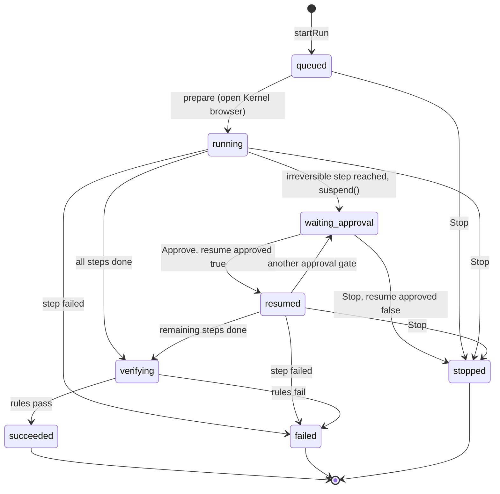
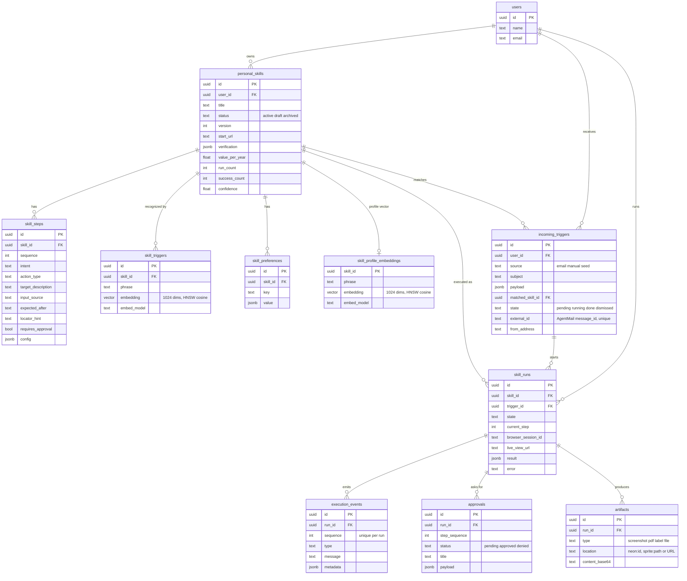

# Architecture

This document goes deeper than the [README](../README.md). Parts that are still being built are
marked **(landing in Wave B)**.

## Run state machine

`skill_runs.state` (`RunState` in `lib/contracts.ts`). The engine creates the run as `queued`, and
the Mastra `choreRun` workflow (`lib/mastra/workflows/chore-run.ts`) drives it through the step
bodies in `lib/engine/engine.ts`.

- Approve calls `getWorkflowRunById(runId)` and then `resume()`. The snapshot is in Neon
  (`PostgresStore`), so this also works from a fresh process. The Mastra runId is
  `skill_runs.id`.
- If the Kernel session is gone, `withRecovery` reopens the browser once and replays the earlier
  steps (each one emits a `log` event "Catching up: …"). It refuses to replay an irreversible step.
- Stop sets an in-process flag that running steps check, denies the pending approval, closes
  the browser and returns the trigger to `pending`. A suspended snapshot is then settled with
  `{ approved: false }`.
- With self-heal, a failed step will first go to the healer instead of `failed`.
  **(landing in Wave B)**

## Data model

From `db/migrations/001_init.sql`, `002_skill_embeddings.sql` and `003_email_triggers.sql`. Mastra
also creates its own `mastra_*` tables (workflow snapshots, spans). The `skill_versions` table
(004) is **(landing in Wave B)**.

## Event types

`execution_events.type` (`EventType`). Every message is human-readable and shown in the activity
list. The run panel receives events over SSE (`GET /api/runs/:id/events`, which polls Neon every 500 ms).

| Type | Emitted when |
|---|---|
| `run.started` | `prepare` marks the run running |
| `browser.opened` | Kernel browser created (metadata: session id, live view URL) |
| `step.started` / `step.succeeded` / `step.failed` | each replayed step (metadata: `stepSequence`, `url`, `usedLocator`) |
| `approval.requested` / `approval.granted` / `approval.denied` | the approval gate, Approve, Stop |
| `verify.started` / `verify.passed` / `verify.failed` | the verification rules on the final page |
| `artifact.saved` | screenshot proof stored |
| `run.succeeded` / `run.failed` / `run.stopped` | terminal states |
| `log` | catch-up progress, browser session reopened |
| `heal.started` / `heal.step` / `heal.research` / `heal.succeeded` / `heal.failed` | self-heal **(landing in Wave B)** |
| `tool.called` | Executor or `.ics` post-action **(landing in Wave B)** |
| `workspace.saved` | file saved to the Fly Sprite **(landing in Wave B)** |

## Healing loop (landing in Wave B)

The design from `docs/PLAN.md` S5 and `docs/CONTRACTS.md` Wave B:

1. A stored step fails (target not found, or its `expectedAfter` text never appears).
2. The healer emits `heal.started`. Exa researches the site's current procedure and emits
   `heal.research` with the query and sources.
3. The agent lists the visible interactive elements on the live page
   (`BrowserAdapter.listInteractive`, including collapsed `
`) and chooses actions toward
   the step's intent until the expected state appears. Each action emits `heal.step`.
4. Once the expected state is reached, the run continues, and the approval gate still applies.
   The new path is saved as skill version N+1 (`SkillVersion`, `reason: 'heal'`). The next run uses it
   directly, with no Exa call.
5. On the demo site v1 to v2, Billing becomes Plan & payments, Manage membership becomes Manage plan,
   Cancel membership becomes End membership (inside "More options"), and Confirm cancellation
   becomes End my membership.

## Retrieval

`lib/skills/retrieve.ts` `matchSkills(userId, text, limit)`:

- The query is embedded with `gte-large-en` (1024 dims) through the Neon AI Gateway.
- The candidates are every trigger phrase of the user's active skills, plus one synthetic
  "title: description" phrase per skill (`skill_profile_embeddings`). Each is scored
  `1 - (embedding <=> query)`, and only rows embedded with the same model count.
- The best phrase per skill is kept. Scores below 0.6 are dropped, along with matches more than 0.15
  below the top one. On the real phrase set, unrelated requests score at most 0.53 and
  paraphrases at least 0.64.
- If the gateway fails, or for skills that were never embedded, keyword overlap is used instead
  (threshold 0.5).
- Callers: the chat tool `findSkill` (accepts a score of 0.3 or more), email ingest (on
  `classification.skillQuery`), and `GET /api/match?q=` for debugging.
